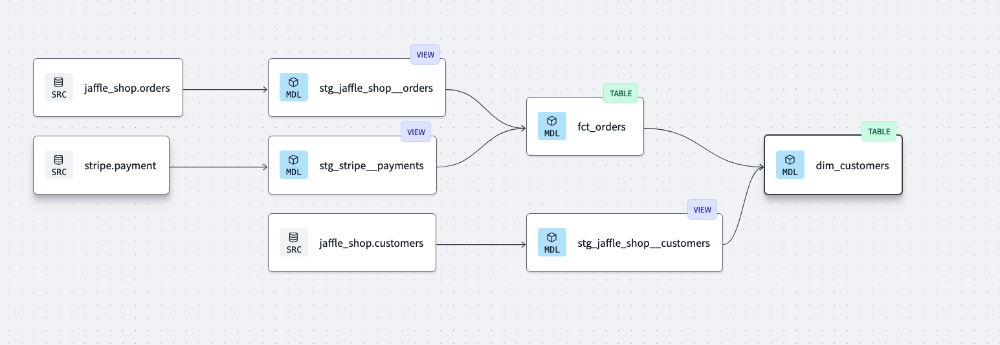

# DBT Fundamentals Repository 🚀

Welcome to my DBT Fundamentals repository! This project highlights my journey learning to use dbt (data build tool) to model data from raw source tables into analysis-ready data assets. Below, you'll find an overview of the concepts, tools, and techniques I applied to build my first data transformation pipeline using BigQuery as the underlying data warehouse.

## 🌟 Key Features

  - Source Modeling: Encapsulated raw source BigQuery tables using dbt's source macro for improved modularity and adaptability to schema changes.
  - Staging Models: Built 1:1 staging models for each source model with light transformations, organized in the models/staging folder.
  - Marts Models: Combined staging models to create fact and dimension models, representing analysis-ready tables for stakeholders, organized in the models/marts folder.
  - De-normalized Modeling: Applied concepts of de-normalized modeling for scalable analytics while maintaining clarity.
  - Modularity: Structured data transformations to support easier debugging, maintenance, and enhancements.

## 🔧 Development Environment Setup

  - Created a BigQuery account and project.
  - Generated a service account key to connect BigQuery to dbt.
  - Configured dbt to work with my local development environment and GitHub for version control.

## 📖 What I Learned
1️⃣ Source Models

  - Used dbt's source macro to encapsulate raw source tables.
  - Modularized source definitions to simplify adjustments when schemas change.

2️⃣ Staging Models

  - Built one staging model per source table for consistent, reusable transformations.
  - Organized staging models under the models/staging folder.

3️⃣ Fact and Dimension Models

  - Combined multiple staging models to create analysis-ready fact and dimension models.
  - Organized these in the models/marts folder.

4️⃣ Data Quality Testing

  - Wrote robust tests to ensure data accuracy and integrity, including:
        - Unique and Non-Null Tests for primary keys.
        - Relational and Accepted Values Tests to validate data consistency.
        - Custom tests for edge-case scenarios.
  - Defined tests in .yml files to integrate directly into the transformation pipeline.

5️⃣ Documentation

  - Leveraged doc blocks and .yml files to create clear, version-controlled documentation for all data assets.

6️⃣ DAG Visualization

  - Used dbt's built-in DAG visualization to track upstream/downstream dependencies and visualize data lineage.

7️⃣ Production Pipeline

  - Created a production job in dbt to refresh transformation pipelines daily, ensuring consistent updates for stakeholders.

## 🌳 Data Lineage Example

Below is a DAG showcasing the data lineage in this project, from source models to marts models. Staging models are materialized as views, and Marts models are materialized as tables.

## 🛠️ Tools and Technologies

  - BigQuery: Cloud-based data warehouse for raw data storage and analytics.
  - dbt: Framework for scalable and modular data transformations.
  - GitHub: Version control and project collaboration.
  - YAML: Configuration for data models, tests, and documentation.
  - SQL: Language for creating and querying data transformations.

Feel free to explore this repository for examples of dbt models, configurations, tests, and documentation. Any feedback or questions are always welcome!

Happy modeling! 🎉
